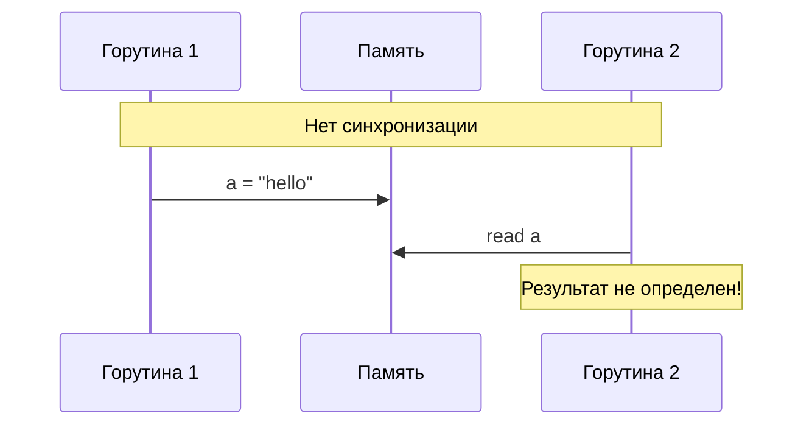
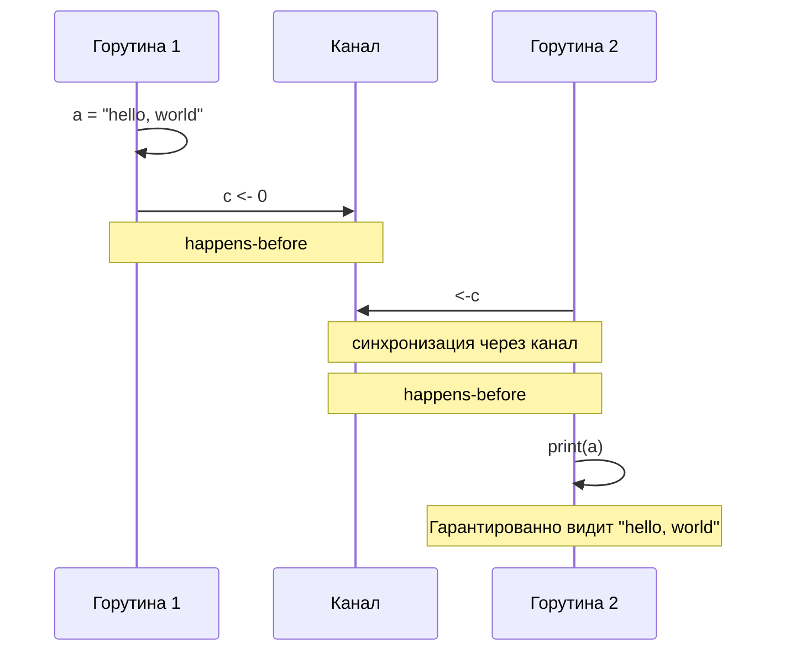
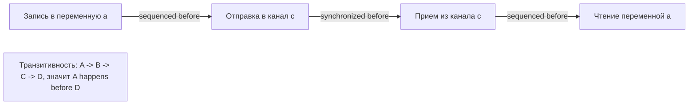
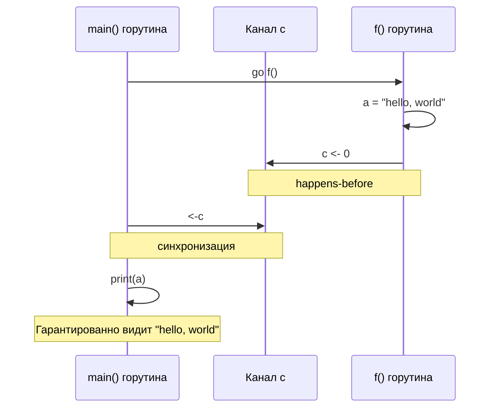
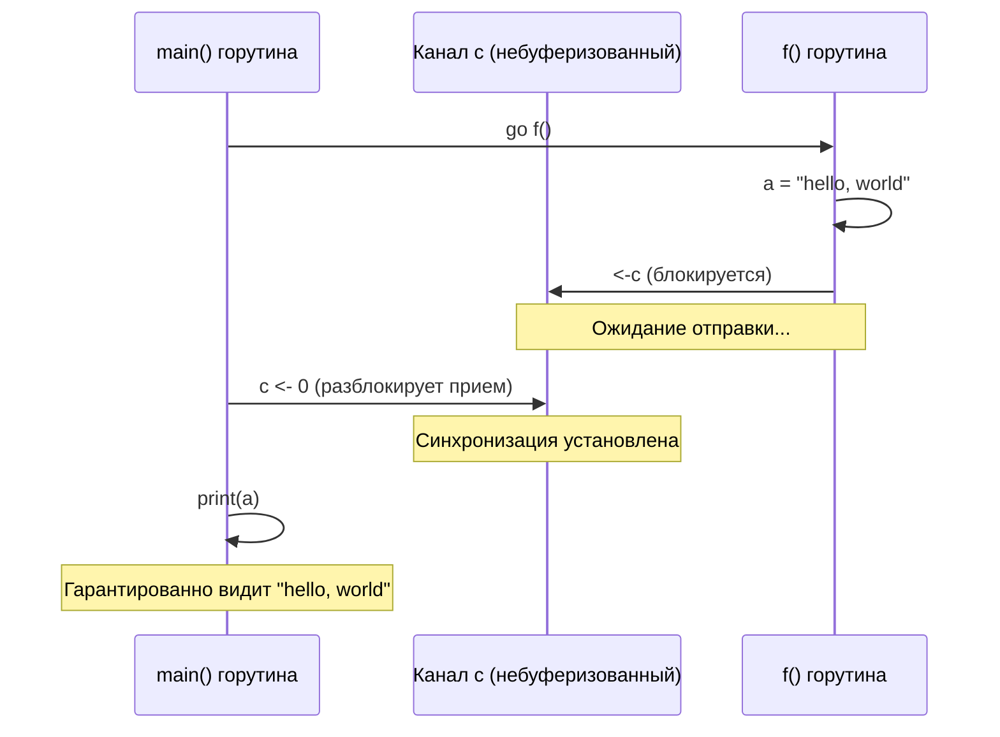
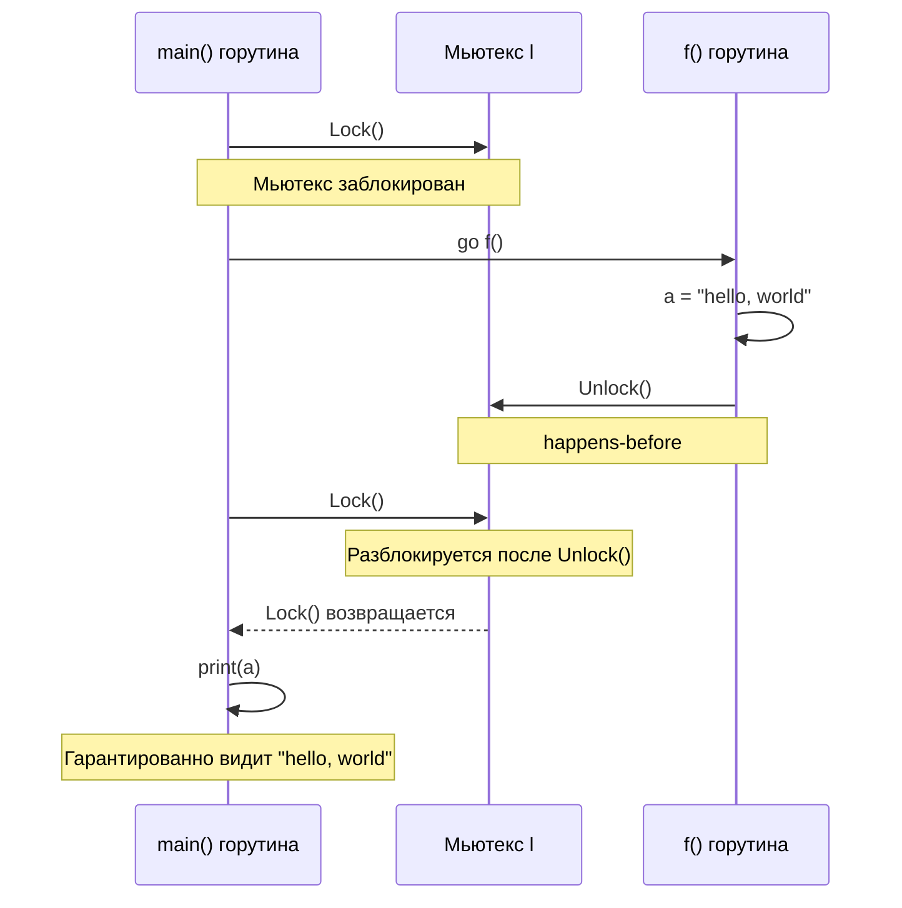
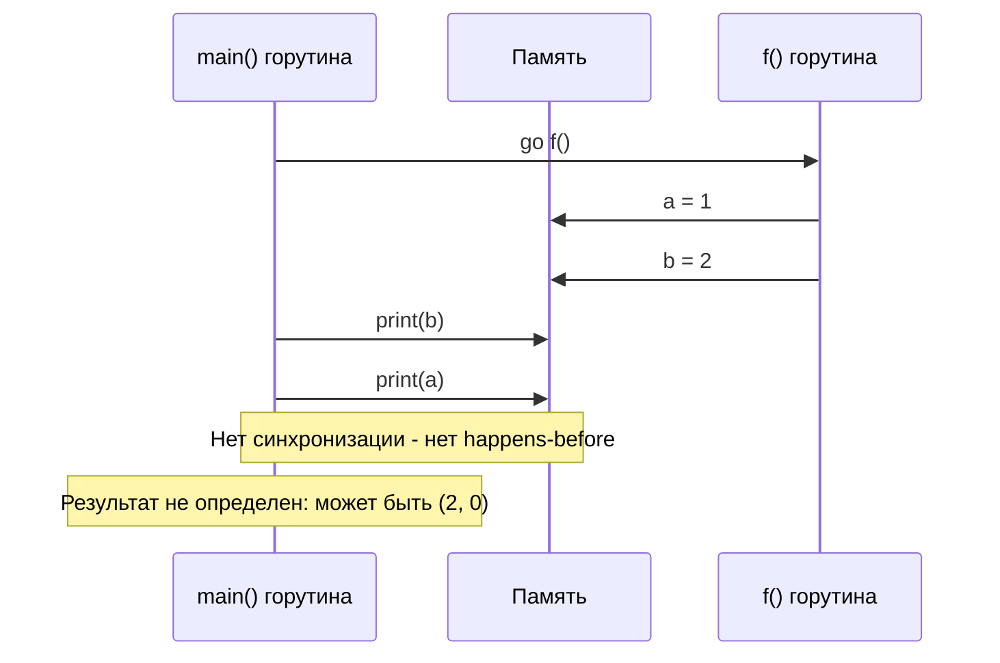

# Модель памяти Go

## Версия от 6 июня 2022 года

## Введение

Модель памяти Go определяет условия, при которых чтение переменной в одной горутине может гарантированно наблюдать значения, записанные в ту же переменную другой горутиной.

### Визуальное представление концепции

Следующая диаграмма иллюстрирует основную идею: без синхронизации горутины могут не видеть изменения друг друга, но с синхронизацией (через каналы, мьютексы и т.д.) мы можем гарантировать порядок операций:

**БЕЗ синхронизации - гонка данных:**



**С синхронизацией через канал:**



### Совет

Программы, которые изменяют данные, одновременно используемые несколькими горутинами, должны сериализовать такой доступ.

Для сериализации доступа защитите данные операциями с каналами или другими примитивами синхронизации, такими как те, что предоставляются в пакетах `sync` и `sync/atomic`.

Если вы должны прочитать остальную часть этого документа, чтобы понять поведение вашей программы, вы слишком умничаете.

Не умничайте.

### Неформальный обзор

Go подходит к модели памяти примерно так же, как и к остальной части языка, стремясь сделать семантику простой, понятной и полезной. В этом разделе дается общий обзор подхода, которого должно быть достаточно для большинства программистов. Модель памяти более формально определена в следующем разделе.

_Гонка данных_ (data race) определяется как запись в ячейку памяти, происходящая одновременно с другим чтением или записью в ту же ячейку, если только все задействованные обращения не являются атомарными обращениями к данным, предоставляемыми пакетом `sync/atomic`. Как уже отмечалось, программистов настоятельно поощряют использовать соответствующую синхронизацию для предотвращения гонок данных. При отсутствии гонок данных программы Go ведут себя так, как если бы все горутины были мультиплексированы на один процессор. Это свойство иногда называют DRF-SC: программы без гонок данных выполняются последовательно согласованным образом.

Хотя программисты должны писать программы Go без гонок данных, есть ограничения на то, что реализация Go может сделать в ответ на гонку данных. Реализация может всегда реагировать на гонку данных, сообщая о гонке и завершая программу. В противном случае каждое чтение из однозначно или подзначно разрядной ячейки памяти должно наблюдать значение, фактически записанное в эту ячейку (возможно, параллельно выполняющейся горутиной) и еще не перезаписанное. Эти ограничения реализации делают Go больше похожим на Java или JavaScript, где большинство гонок имеют ограниченное количество исходов, и менее похожим на C и C++, где значение любой программы с гонкой полностью не определено, и компилятор может делать что угодно. Подход Go направлен на то, чтобы сделать ошибочные программы более надежными и легкими для отладки, при этом настаивая на том, что гонки — это ошибки, и инструменты могут диагностировать и сообщать о них.

## Модель памяти

Следующее формальное определение модели памяти Go тесно следует подходу, представленному Хансом-Й. Бёмом и Саритой В. Адве в "Foundations of the C++ Concurrency Memory Model", опубликованном на PLDI 2008. Определение программ без гонок данных и гарантия последовательной согласованности для программ без гонок эквивалентны тем, что описаны в этой работе.

Модель памяти описывает требования к выполнению программ, которые состоят из выполнений горутин, которые в свою очередь состоят из операций с памятью.

_Операция с памятью_ моделируется четырьмя деталями:

* её вид, указывающий, является ли она обычным чтением данных, обычной записью данных или _синхронизирующей операцией_, такой как атомарный доступ к данным, операция с мьютексом или операция с каналом,
* её местоположение в программе,
* ячейка памяти или переменная, к которой осуществляется доступ, и
* значения, прочитанные или записанные операцией.

Некоторые операции с памятью являются _читающими_, включая чтение, атомарное чтение, блокировку мьютекса и прием из канала. Другие операции с памятью являются _записывающими_, включая запись, атомарную запись, разблокировку мьютекса, отправку в канал и закрытие канала. Некоторые, такие как атомарная операция сравнения и замены, являются одновременно читающими и записывающими.

_Выполнение горутины_ моделируется как набор операций с памятью, выполненных одной горутиной.

**Требование 1**: Операции с памятью в каждой горутине должны соответствовать правильному последовательному выполнению этой горутины с учетом значений, прочитанных из памяти и записанных в память. Это выполнение должно быть согласовано с отношением _упорядочено до_ (sequenced before), определенным как требования частичного порядка, изложенные спецификацией языка Go для конструкций управления потоком Go, а также порядок вычисления выражений.

_Выполнение программы Go_ моделируется как набор выполнений горутин вместе с отображением _W_, которое указывает записывающую операцию, которую каждая читающая операция читает. (Несколько выполнений одной и той же программы могут иметь разные выполнения программы.)

**Требование 2**: Для данного выполнения программы отображение _W_, ограниченное синхронизирующими операциями, должно быть объяснимо некоторым неявным полным порядком синхронизирующих операций, который согласован с упорядочением и значениями, прочитанными и записанными этими операциями.

Отношение _синхронизировано до_ (synchronized before) — это частичный порядок на синхронизирующих операциях с памятью, выведенный из _W_. Если синхронизирующая читающая операция с памятью _r_ наблюдает синхронизирующую записывающую операцию с памятью _w_ (то есть, если _W_(_r_) = _w_), то _w_ синхронизировано до _r_. Неформально, отношение синхронизировано до является подмножеством неявного полного порядка, упомянутого в предыдущем абзаце, ограниченным информацией, которую _W_ непосредственно наблюдает.

Отношение _происходит до_ (happens before) определяется как транзитивное замыкание объединения отношений упорядочено до и синхронизировано до.

**Визуализация отношения "происходит до":**



**Требование 3**: Для обычного (несинхронизирующего) чтения данных _r_ из ячейки памяти _x_, _W_(_r_) должна быть записью _w_, которая _видима_ для _r_, где видимая означает, что оба следующих условия выполняются:

1. _w_ происходит до _r_.
2. _w_ не происходит до какой-либо другой записи _w'_ (в _x_), которая происходит до _r_.

_Гонка данных чтение-запись_ в ячейке памяти _x_ состоит из читающей операции с памятью _r_ в _x_ и записывающей операции с памятью _w_ в _x_, по крайней мере одна из которых несинхронизирующая, которые не упорядочены по отношению происходит до (то есть, ни _r_ не происходит до _w_, ни _w_ не происходит до _r_).

_Гонка данных запись-запись_ в ячейке памяти _x_ состоит из двух записывающих операций с памятью _w_ и _w'_ в _x_, по крайней мере одна из которых несинхронизирующая, которые не упорядочены по отношению происходит до.

Заметьте, что если нет гонок данных чтение-запись или запись-запись в ячейке памяти _x_, то любое чтение _r_ из _x_ имеет только одно возможное _W_(_r_): единственную _w_, которая непосредственно предшествует ей в порядке происходит до.

Более generally, можно показать, что любая программа Go, которая не имеет гонок данных, то есть не имеет выполнений программы с гонками данных чтение-запись или запись-запись, может иметь только исходы, объяснимые некоторой последовательно согласованной чередующейся последовательностью выполнений горутин. (Доказательство такое же, как в разделе 7 работы Бёма и Адве.)

Предыдущий абзац — это обещание, данное компиляторам и процессорам в программе Go: если программа Go не содержит гонок данных, программисты могут безопасно предполагать, что выполнение программы будет последовательно согласованным. Это свойство позволяет программистам рассуждать о своих программах.

## Синхронизация

### Инициализация

Инициализация программы выполняется в одной горутине, но эта горутина может создавать другие горутины, которые выполняются одновременно.

Если пакет `p` импортирует пакет `q`, завершение выполнения функции `init` пакета `q` происходит до начала выполнения любого кода пакета `p`.

Запуск функции `main.main` происходит после завершения всех функций `init`.

### Создание горутины

Инструкция `go`, которая запускает новую горутину, происходит до начала выполнения горутины.

Например, в этой программе:

```go
var a string

func f() {
	print(a)
}

func hello() {
	a = "hello, world"
	go f()
}
```

вызов `hello` напечатает `"hello, world"` в какой-то момент в будущем (возможно, после того, как `hello` вернется).

### Уничтожение горутины

Гарантий относительно того, когда горутина завершается, нет. Например, в этой программе:

```go
var a string

func hello() {
	go func() { a = "hello" }()
	print(a)
}
```

присваивание `a` не сопровождается никакой синхронизацией, поэтому нет гарантии, что оно будет наблюдаться любой другой горутиной. Фактически, агрессивный компилятор может удалить всю инструкцию `go`.

Чтобы гарантировать, что эффект горутины наблюдается, используйте механизм синхронизации, такой как блокировка или связь через канал.

### Коммуникация через канал

Коммуникация через канал — это основной метод синхронизации между горутинами. Каждая отправка в конкретный канал сопоставляется с соответствующим приемом из этого канала, обычно выполняемым в другой горутине.

Отправка в канал происходит до завершения соответствующего приема из этого канала.

**Диаграмма синхронизации через буферизованный канал:**



Эта программа:

```go
var c = make(chan int, 10)
var a string

func f() {
	a = "hello, world"
	c <- 0
}

func main() {
	go f()
	<-c
	print(a)
}
```

гарантированно напечатает `"hello, world"`. Запись в `a` происходит до отправки в `c`, которая происходит до соответствующего приема из `c`, завершение которого происходит до `print`.

Закрытие канала происходит до приема, который возвращает нулевое значение, потому что канал закрыт.

В предыдущем примере замена `c <- 0` на `close(c)` дает программу с одинаковым гарантированным поведением.

Прием из небуферизованного канала происходит до завершения соответствующей отправки в этот канал.

**Диаграмма синхронизации через небуферизованный канал:**



Эта программа (как и выше, но с обменом операций отправки и приема и использованием небуферизованного канала):

```go
var c = make(chan int)
var a string

func f() {
	a = "hello, world"
	<-c
}

func main() {
	go f()
	c <- 0
	print(a)
}
```

также гарантированно напечатает `"hello, world"`. Запись в `a` происходит до приема из `c`, который происходит до завершения соответствующей отправки в `c`, которая происходит до `print`.

Если канал буферизован (например, `c = make(chan int, 1)`), то программа не гарантированно напечатает `"hello, world"`. (Может напечатать пустую строку, напечатать `"hello, world"` или вызвать панику.)

_k_-й прием из канала с емкостью _C_ происходит до завершения (_k_+_C_)-й отправки в этот канал.

Это правило обобщает предыдущее правило для небуферизованных каналов на буферизованные каналы. Это позволяет моделировать счетчик в буферизованном канале: счетчик семантически увеличивается при отправке и уменьшается при приеме.

В этой программе:

```go
var c = make(chan int, 3)
var a string

func f() {
	a = "hello, world"
	c <- 1
	c <- 2
	c <- 3
}

func main() {
	go f()
	<-c
	print(a)
}
```

запись в `a` происходит до отправки в `c`, которая происходит до соответствующего приема из `c`, завершение которого происходит до `print`, поэтому эта программа также гарантированно напечатает `"hello, world"`.

### Блокировки

Пакет `sync` реализует два типа данных блокировки: `sync.Mutex` и `sync.RWMutex`.

Для любого `sync.Mutex` или `sync.RWMutex` переменной `l` и _n_ < _m_, _n_-й вызов `l.Unlock()` происходит до возврата (_m_+1)-го вызова `l.Lock()`.

**Диаграмма синхронизации через мьютекс:**



Эта программа:

```go
var l sync.Mutex
var a string

func f() {
	a = "hello, world"
	l.Unlock()
}

func main() {
	l.Lock()
	go f()
	l.Lock()
	print(a)
}
```

гарантированно напечатает `"hello, world"`. Первый вызов `l.Unlock()` (в `f`) происходит до возврата второго вызова `l.Lock()` (в `main`), который происходит до `print`.

Для любого вызова `l.RLock()` на `sync.RWMutex` переменной `l`, существует _n_ такое, что _n_-й вызов `l.Unlock()` происходит до возврата `l.RLock()`, и `l.RLock()` происходит (происходит до) до возврата (_n_+1)-го вызова `l.Lock()`.

### Один раз

Функция `sync.Once` предоставляет механизм для множественного вызова, который гарантирует, что функция-аргумент выполняется только один раз.

Множественные вызовы `once.Do(f)` выполняют `f` только один раз. Выполнение одного вызова `f()` происходит до возврата любого вызова `once.Do(f)`.

В этой программе:

```go
var a string
var once sync.Once

func setup() {
	a = "hello, world"
}

func doprint() {
	once.Do(setup)
	print(a)
}

func twoprint() {
	go doprint()
	go doprint()
}
```

вызов `twoprint` вызовет `setup` ровно один раз. Функция `setup` завершится до любого вызова `print`. Результатом будет дважды напечатанный `"hello, world"`.

### Атомарные значения

API пакета `sync/atomic`, определенный в пакете `sync/atomic`, определен как синхронизирующая операция. Атомарные операции, выполняемые несколькими горутинами, синхронизированы в едином согласованном порядке, который может быть не таким же, как порядок, наблюдаемый в любой отдельной горутине.

Если эффект атомарной операции _A_ наблюдается атомарной операцией _B_, то _A_ синхронизировано до _B_. Все атомарные операции, выполненные в программе, ведут себя так, как будто они выполнены в некотором последовательно согласованном порядке.

Предыдущее определение имеет ту же семантику, что и последовательно согласованные атомарные операции C++ и переменные `volatile` Java.

### Финализаторы

Пакет `runtime` предоставляет функцию `SetFinalizer`, которая добавляет финализатор для вызова, когда конкретный объект больше не достижим программой. Вызов `SetFinalizer(x, f)` синхронизирован до вызова финализации `f(x)`.

### Дополнительные механизмы

Пакет `sync` предоставляет дополнительные абстракции синхронизации, включая переменные условий, блокировочно-свободные карты, пулы выделения памяти и группы ожидания. Документация для каждого из них указывает гарантии, которые они предоставляют относительно синхронизации.

Другие пакеты, которые предоставляют абстракции синхронизации, также должны документировать предоставляемые ими гарантии.

## Неправильная синхронизация

Программы с гонками некорректны и могут демонстрировать выполнение, не являющееся последовательно согласованным. В частности, обратите внимание, что чтение _r_ может наблюдать значение, записанное любой записью _w_, которая выполняется одновременно с _r_. Даже если это происходит, это не означает, что чтения, происходящие после _r_, будут наблюдать записи, произошедшие до _w_.

**Диаграмма гонки данных (без синхронизации):**



В этой программе:

```go
var a, b int

func f() {
	a = 1
	b = 2
}

func g() {
	print(b)
	print(a)
}

func main() {
	go f()
	g()
}
```

может случиться так, что `g` напечатает `2`, а затем `0`.

Этот факт делает недействительными некоторые распространенные идиомы.

Двойная проверка блокировки — это попытка избежать накладных расходов синхронизации. Например, программа `twoprint` может быть некорректно записана как:

```go
var a string
var done bool

func setup() {
	a = "hello, world"
	done = true
}

func doprint() {
	if !done {
		once.Do(setup)
	}
	print(a)
}

func twoprint() {
	go doprint()
	go doprint()
}
```

но нет гарантии, что в `doprint` наблюдение записи в `done` подразумевает наблюдение записи в `a`. Эта версия может (некорректно) напечатать пустую строку вместо `"hello, world"`.

Другая неправильная идиома — это активное ожидание значения, как в:

```go
var a string
var done bool

func setup() {
	a = "hello, world"
	done = true
}

func main() {
	go setup()
	for !done {
	}
	print(a)
}
```

Как и прежде, нет гарантии, что в `main` наблюдение записи в `done` подразумевает наблюдение записи в `a`, поэтому эта программа также может напечатать пустую строку. Хуже того, нет гарантии, что запись в `done` когда-либо будет наблюдаться `main`, поскольку нет синхронизирующих событий между двумя потоками. Цикл в `main` не гарантированно завершится.

Есть более тонкие варианты на эту тему, такие как эта программа.

```go
type T struct {
	msg string
}

var g *T

func setup() {
	t := new(T)
	t.msg = "hello, world"
	g = t
}

func main() {
	go setup()
	for g == nil {
	}
	print(g.msg)
}
```

Даже если `main` наблюдает `g != nil` и выходит из цикла, нет гарантии, что он будет наблюдать инициализированное значение для `g.msg`.

Во всех этих примерах решение одно и то же: используйте явную синхронизацию.

## Неправильная компиляция

Модель памяти Go ограничивает оптимизации компилятора так же, как и программы Go. Некоторые оптимизации компилятора, которые были бы валидны в однопоточных программах, не являются валидными во всех программах Go. В частности, компилятор не должен вводить записи, которых не существует в исходной программе, он не должен позволять одному чтению наблюдать несколько значений, и он не должен позволять одной записи записывать несколько значений.

Все следующие примеры предполагают, что `*p` и `*q` ссылаются на ячейки памяти, доступные нескольким горутинам.

Недопустимость введения гонок данных в программы без гонок означает невозможность выноса записей из условных операторов, в которых они появляются. Например, компилятор не должен инвертировать условие в этой программе:

```go
*p = 1
if cond {
	*p = 2
}
```

То есть компилятор не должен переписывать программу в эту:

```go
*p = 2
if !cond {
	*p = 1
}
```

Если `cond` ложное и другая горутина читает `*p`, то в исходной программе другая горутина может наблюдать только любое предыдущее значение `*p` и `1`. В переписанной программе другая горутина может наблюдать `2`, что ранее было невозможно.

Недопустимость введения гонок данных также означает невозможность предположения, что циклы завершаются. Например, компилятор в общем случае не должен выносить обращения к `*p` или `*q` перед циклом в этой программе:

```go
n := 0
for e := list; e != nil; e = e.next {
	n++
}
i := *p
*q = 1
```

Если `list` указывает на циклический список, то исходная программа никогда не обратится к `*p` или `*q`, но переписанная программа обратится. (Вынос `*p` был бы безопасен, если компилятор может доказать, что `*p` не вызовет панику; вынос `*q` также потребовал бы от компилятора доказательства, что никакая другая горутина не может обратиться к `*q`.)

Недопустимость введения гонок данных также означает невозможность предположения, что вызываемые функции всегда возвращаются или свободны от синхронизирующих операций. Например, компилятор не должен выносить обращения к `*p` или `*q` перед вызовом функции в этой программе (по крайней мере, без прямого знания точного поведения `f`):

```go
f()
i := *p
*q = 1
```

Если вызов никогда не вернется, то снова исходная программа никогда не обратится к `*p` или `*q`, но переписанная программа обратится. И если вызов содержал синхронизирующие операции, то исходная программа могла установить ребра отношения происходит до, предшествующие обращениям к `*p` и `*q`, но переписанная программа не могла.

Недопустимость того, чтобы одно чтение наблюдало несколько значений, означает невозможность перезагрузки локальных переменных из разделяемой памяти. Например, компилятор не должен отбрасывать `i` и перезагружать его второй раз из `*p` в этой программе:

```go
i := *p
if i < 0 || i >= len(funcs) {
	panic("invalid function index")
}
... complex code ...
// компилятор НЕ ДОЛЖЕН перезагружать i = *p здесь
funcs[i]()
```

Если сложный код требует много регистров, компилятор для однопоточных программ мог бы отбросить `i`, не сохранив копию, а затем перезагрузить `i = *p` непосредственно перед `funcs[i]()`. Компилятор Go не должен этого делать, потому что значение `*p` могло измениться. (Вместо этого компилятор мог бы сохранить `i` в стеке.)

Недопустимость того, чтобы одна запись записывала несколько значений, также означает невозможность использования памяти, в которую будет записана локальная переменная, в качестве временного хранилища перед записью. Например, компилятор не должен использовать `*p` в качестве временного хранилища в этой программе:

```go
*p = i + *p/2
```

То есть он не должен переписывать программу в эту:

```go
*p /= 2
*p += i
```

Если `i` и `*p` начинаются равными 2, исходный код делает `*p = 3`, поэтому параллельная нить может прочитать только 2 или 3 из `*p`. Переписанный код делает `*p = 1`, а затем `*p = 3`, позволяя параллельной нити прочитать также 1.

Заметьте, что все эти оптимизации разрешены в компиляторах C/C++: компилятор Go, использующий общий бэкенд с компилятором C/C++, должен позаботиться о том, чтобы отключить оптимизации, которые недействительны для Go.

Заметьте, что запрет на введение гонок данных не применяется, если компилятор может доказать, что гонки не влияют на правильное выполнение на целевой платформе. Например, на практически всех CPU допустимо переписать

```go
n := 0
for i := 0; i < m; i++ {
	n += *shared
}
```

в:

```go
n := 0
local := *shared
for i := 0; i < m; i++ {
	n += local
}
```

при условии, что можно доказать, что `*shared` не вызовет ошибку при доступе, потому что потенциально добавленное чтение не повлияет на какие-либо существующие параллельные чтения или записи. С другой стороны, переписывание не было бы валидным в трансляторе исходного кода в исходный код.

## Заключение

Программисты Go, пишущие программы без гонок данных, могут полагаться на последовательно согласованное выполнение этих программ, как и в практически всех других современных языках программирования.

Когда дело доходит до программ с гонками, и программисты, и компиляторы должны помнить совет: не умничайте.

---

**Источник:** [The Go Memory Model - go.dev](https://go.dev/ref/mem)

